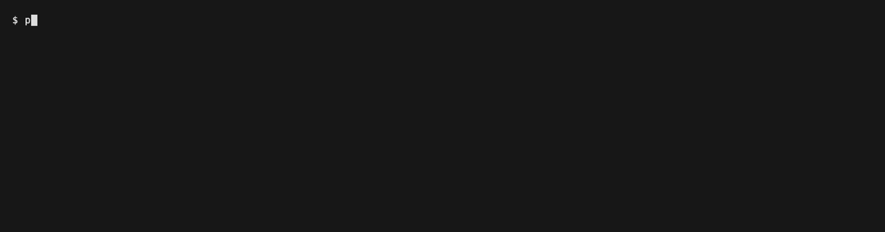

# consentprobe

Measure what a website really does **before and after** a visitor answers the cookie banner.

`consentprobe` loads a page in a real browser three times, each visit with its own empty cookie jar:

1. **Baseline:** no interaction. Which third parties are contacted, which cookies are set?
2. **Reject:** click the banner's reject control. Does tracking stop?
3. **Accept:** click accept. What does consent actually unlock?

It reports technical findings with evidence. It does **not** give legal advice and does not decide whether a law is violated.

> Status: early (0.1.0), not yet published to npm. Run it from source, see below.

## Why another scanner?

Most open-source privacy scanners measure only the first page load. What matters under § 25 TDDDG and the GDPR is often what happens **after** the visitor clicks "reject". `consentprobe` tests that path and compares it with the baseline.

## Example

Output for a test page whose banner ignores the reject click (a local fixture, not a real site). Run it yourself with `pnpm demo`.



```
consentprobe 0.1.0  http://localhost:PORT/banner-bad
Phase: before-consent (no interaction with any cookie banner), then reject and accept visits
Consent banner: recognized | reject: found ("Alle ablehnen") | accept: found ("Alle akzeptieren")
2 error, 0 warn, 1 info | 0 third-party host(s), 1 request(s), 0 cookie(s)

[ERROR] Demo Analytics (analytics): 1 request(s) after the reject control was clicked.
        https://tracker.example/analytics.js
[ERROR] Google Analytics cookie(s) set or changed after the reject control was clicked.
        _ga (localhost)
[INFO] Accepting loaded 1 known service(s) (Demo Analytics) and 0 further unclassified third-party host(s).

Technical findings only. This is not legal advice and does not assess whether a data-protection or accessibility law is violated.
```

## What it checks

| Check | Severity |
|---|---|
| Analytics, advertising, external fonts contacted before consent | error |
| Known tracker cookies before consent (`_ga`, `_fbp`, Adobe, Hotjar, …) | error |
| Tracker requests or cookies still present after **reject** | error |
| Tag manager, social, chat, maps, video, public CDNs before consent | warn |
| Accept control found, but no general reject control on the first layer | warn |
| Imprint (Impressum) or privacy policy link missing or returns HTTP ≥ 400 | error |
| Legal link only weakly matched (shown as a candidate to check) | warn |
| What accepting loaded in addition, unclassified third-party hosts, consent platform and Cloudflare cookies | info |
| A cookie overlay is visible but its controls are not automatable (e.g. a checkbox plus "save") | info |
| Google Consent Mode "denied" pings after reject (`gcs=G100`) | warn |
| Parts of the page did not respond, so the banner search is incomplete | info |

The imprint check runs only on German-language sites (`<html lang="de">` or `.de/.at/.ch`) unless you pass `--imprint always`.

## Install and run (from source)

The CLI runs on Node 20+. Building from source needs Node 22+ and pnpm 11 (pnpm 11 itself requires Node 22).

```bash
git clone https://github.com/Elijas121/consentprobe.git && cd consentprobe
pnpm install
pnpm exec playwright install chromium
pnpm build
node dist/cli.js https://example.com
```

If no browser is installed, the tool tells you to run `npx playwright install chromium`.

Common options:

```bash
node dist/cli.js https://example.de --format md --out report.md
node dist/cli.js https://example.de --format json --fail-on warn
node dist/cli.js https://example.de --screenshots ./evidence
node dist/cli.js https://example.de --first-party assets.example-cdn.de
```

| Option | Meaning |
|---|---|
| `--format text\|json\|md` | Output format (default `text`) |
| `--out <file>` | Write the report to a file |
| `--fail-on error\|warn\|never` | Exit code 1 at this severity or above (default `error`) |
| `--no-click-test` | Baseline only, skip the reject and accept visits |
| `--screenshots <dir>` | Save evidence screenshots before and after each click |
| `--first-party <domain>` | Extra domain of the site operator, e.g. its own asset CDN (repeatable) |
| `--imprint auto\|always\|never` | Imprint check mode (default `auto`) |
| `--settle <ms>` / `--timeout <ms>` / `--banner-wait <ms>` | Timing controls |
| `--browser chromium\|chrome` | Bundled Chromium or your installed Chrome |
| `--rules <file>` | JSON file with extra tracker rules |

Exit codes: `0` passed, `1` findings at or above `--fail-on`, `2` usage error or page not measurable.

### Extra tracker rules

```json
[
  { "id": "my-crm", "name": "My CRM widget", "category": "chat", "hosts": ["widget.my-crm.example"] }
]
```

Categories: `analytics`, `advertising`, `tag-manager`, `social`, `fonts`, `maps`, `video`, `chat`, `cdn`, `captcha`, `consent-platform`. An optional `pathPrefix` limits a rule to a path.

## Use it in CI

`action.yml` is a composite GitHub Action. It installs the tool, scans the URL and writes the Markdown report into the job summary. In a public repository the job summary is public, so point it only at sites you own or are authorized to test:

```yaml
- uses: Elijas121/consentprobe@main
  with:
    url: https://staging.example.de
    fail-on: error
```

## Use it with a coding agent

`skills/consentprobe/SKILL.md` teaches Claude Code and similar agents to run the scan, read the JSON, and explain each finding with a concrete fix, without giving legal conclusions.

## Limits you should know

- **Banners depend on location.** A banner may not appear from your IP address (some sites show one only in the EU). No banner recognized does not mean the site has none.
- **Only the first layer is tested.** Choices hidden behind "Settings" are not explored.
- **One page per run.** No logins, no multi-page crawl.
- **Bot protection.** Some sites answer headless browsers with HTTP 403. The tool then refuses to measure instead of reporting the error page.
- **It never hangs.** Every question to the page has a time limit and the whole scan has a hard deadline. A frame that never loads leads to "search incomplete", not to a stuck CI job.
- **Consent platforms are matched by selector and wording** (German and English). It clicks only a control that clearly is a general reject or accept, and only inside a real overlay. Unusual wording is reported as "not found", never guessed.
- **The tracker list is curated by hand and incomplete.** Unknown hosts appear as info. Third-party lists such as DuckDuckGo Tracker Radar, Disconnect and Ghostery TrackerDB are licensed CC BY-NC-SA and are therefore not bundled.
- **Consent Mode.** A tag manager can load before consent and still block its tags. That is why tag managers are warnings, and the analytics and advertising findings show what really loaded.
- **A finding is a measurement, not a verdict.** Use `--screenshots` to verify what was clicked, and check the site yourself before you tell anyone it violates something.

## How accurate is it?

Tested on 71 real websites in three samples, two of them judged blind (full method and limits in [docs/VALIDATION.md](docs/VALIDATION.md)):

- Banner, reject control and accept control detected correctly on **69/69, 66/66 and 64/64** sites. On a blind sample before tuning it was 25/26, 22/24 and 20/23; every miss was "not found", never a wrong claim.
- **70 clicks, zero on the wrong control.**
- Three real cases of tracking after reject, each confirmed with before/after screenshots.
- Two sites where a third-party frame never loads get "search incomplete" instead of a guess.

This is a small sample judged by one reviewer. Treat it as evidence, not as a benchmark.

## Privacy of the tool

Everything runs on your machine. Query strings are removed from recorded URLs because they can contain personal data. Nothing is sent to any service.

## Development

```bash
pnpm test        # unit tests plus real-browser tests against local fixtures
pnpm typecheck
pnpm build
pnpm demo        # run the README example against local fixtures and write screenshots to a temp folder
vhs docs/demo.tape  # re-record docs/demo.gif (needs https://github.com/charmbracelet/vhs)
```

See `AGENTS.md` for conventions, `docs/VALIDATION.md` for how accuracy was measured and `docs/RESEARCH.md` for prior art and data licenses.

## License

MIT
